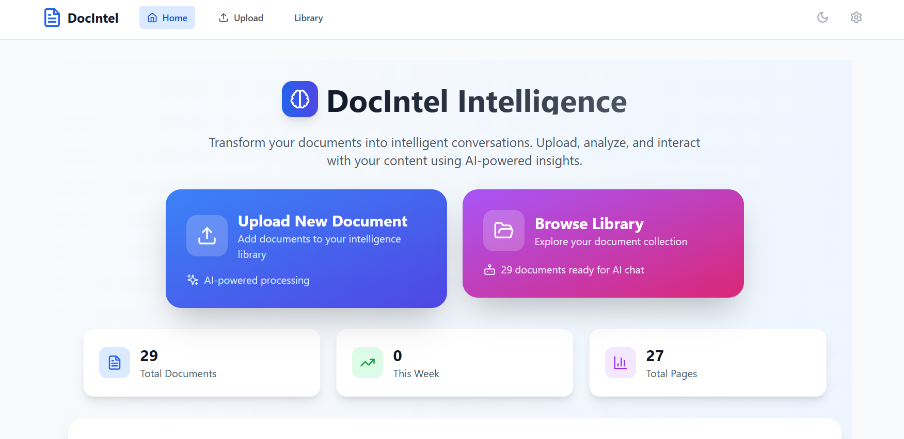
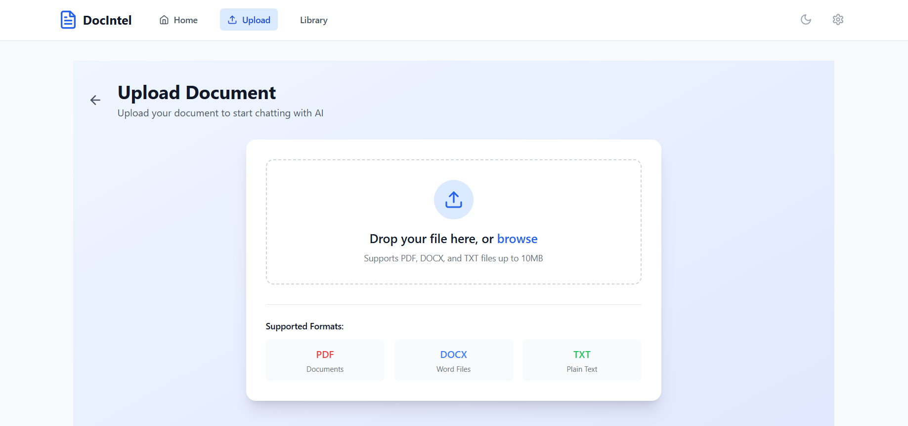
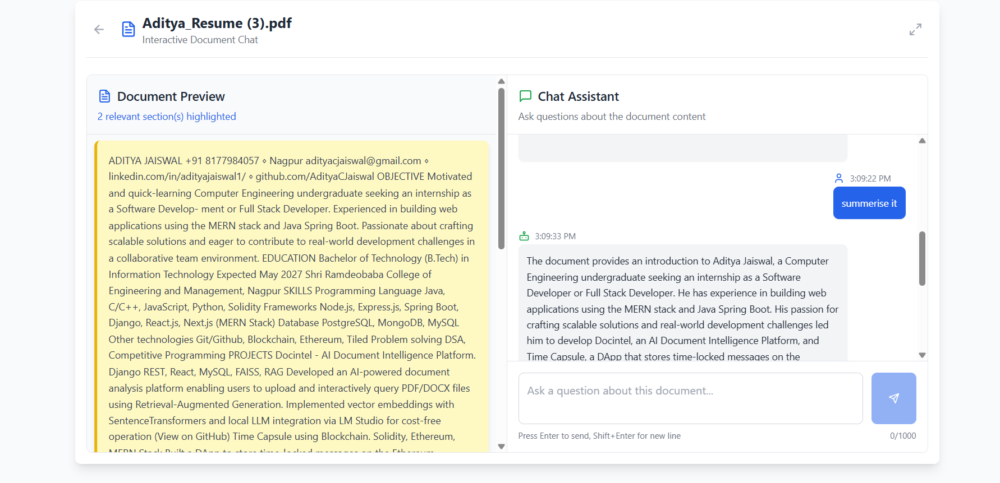
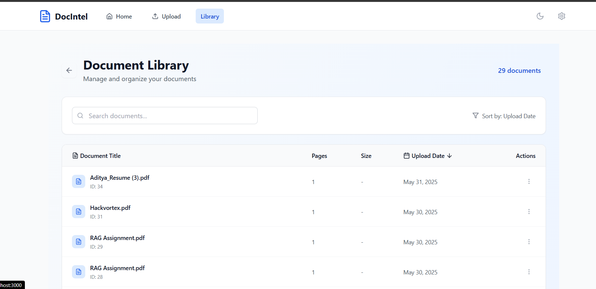

# 🧠 Docintel - AI-Powered Document Intelligence Platform

**Docintel** is a comprehensive Document Intelligence Platform that leverages AI to help users interact with their documents through natural language queries. Upload documents, extract content automatically, and chat with your files using advanced Retrieval-Augmented Generation (RAG) technology.

## 📱 Screenshots

### Demo


### Main Interface


### Document Upload


### Chat Interface


### Document Library


## ✨ Features

### 📄 Smart Document Processing
- **Multi-format Support**: Upload PDF, DOCX, and TXT files
- **Automatic Parsing**: Intelligent content extraction and chunking
- **Vector Embeddings**: Advanced semantic search capabilities using SentenceTransformers

### 💬 Interactive Document Chat
- **RAG-Powered Conversations**: Ask questions and get contextual answers from your documents
- **Real-time Responses**: Instant AI-generated answers based on document content
- **Session History**: Previous conversations stored per document

### 📚 Document Management
- **Document Library**: Browse and manage all uploaded documents
- **Metadata Display**: View document details (title, type, upload date, page count)
- **Sort & Filter**: Organize documents efficiently
- **Delete Functionality**: Remove documents and associated data

### 🎨 Intuitive Interface
- **Split-Panel Design**: Document preview on left, chat interface on right
- **Highlighting**: Referenced document sections highlighted in preview
- **Responsive Layout**: Works seamlessly on desktop and mobile
- **Live Redirects**: Auto-redirect to chat after document upload

## 🏗️ Architecture

### Backend (Django REST Framework)
```
rag_backend/
├── rag_backend/
│   ├── settings.py
│   ├── urls.py
│   └── wsgi.py
├── core/
│   ├── models.py
│   ├── rag_utils.py
│   ├── views.py
│   ├── serializers.py
│   └── urls.py
├── manage.py
└── requirements.txt
```

### Frontend (React + Tailwind CSS)
```
docintel-frontend/
├── src/
│   ├── components/
│   │   ├── DocumentLibrary.js
│   │   ├── DocumentUpload.js
│   │   ├── ChatInterface.js
│   │   └── DocumentPreview.js
│   ├── context/
│   │   └── AppContext.js
│   ├── pages/
│   │   ├── Home.js
│   │   └── ChatPage.js
│   └── App.js
└── package.json
```

## 🛠️ Tech Stack

### Backend Technologies
- **Framework**: Django REST Framework
- **Database**: MySQL (metadata storage)
- **Vector Database**: FAISS (similarity search)
- **Document Parsing**: 
  - `pdfplumber` (PDF processing)
  - `python-docx` (Word documents)
- **Embeddings**: SentenceTransformers (`all-MiniLM-L6-v2`)
- **AI Integration**: LM Studio (local LLM server)

### Frontend Technologies
- **Framework**: React 18
- **Styling**: Tailwind CSS
- **Routing**: React Router
- **State Management**: React Context API
- **HTTP Client**: Axios
- **File Upload**: Multipart form handling

## 💻 Installation & Setup

### Prerequisites
- Python 3.8+
- Node.js 16+
- MySQL 8.0+
- LM Studio (for local LLM)

### Backend Setup

1. **Clone the repository**
```bash
git clone https://github.com/yourusername/docintel.git
cd docintel/backend
```

2. **Create virtual environment**
```bash
python -m venv venv
source venv/bin/activate  # On Windows: venv\Scripts\activate
```

3. **Install dependencies**
```bash
pip install -r requirements.txt
```

4. **Configure Database**
```bash
# Update settings.py with your MySQL credentials
DATABASES = {
    'default': {
        'ENGINE': 'django.db.backends.mysql',
        'NAME': 'docintel_db',
        'USER': 'your_mysql_user',
        'PASSWORD': 'your_mysql_password',
        'HOST': 'localhost',
        'PORT': '3306',
    }
}
```

5. **Run migrations**
```bash
python manage.py makemigrations
python manage.py migrate
```

6. **Start development server**
```bash
python manage.py runserver
```

### Frontend Setup

1. **Navigate to frontend directory**
```bash
cd ../frontend
```

2. **Install dependencies**
```bash
npm install
```

3. **Start development server**
```bash
npm start
```

### LM Studio Setup

1. **Download and install LM Studio** from [https://lmstudio.ai](https://lmstudio.ai)

2. **Download a compatible model** (recommended: Llama 2 7B or similar)

3. **Start the local server** on default port `http://localhost:1234`

4. **Update backend configuration** to point to your LM Studio endpoint

## 🚀 Usage

### Document Upload
1. Navigate to the home page
2. Click "Upload Document" or drag-and-drop files
3. Supported formats: PDF, DOCX, TXT
4. Automatic processing and redirection to chat interface

### Chatting with Documents
1. Select a document from your library
2. Type questions in the chat interface
3. Receive AI-generated answers with source highlighting
4. View previous conversation history

### Document Management
1. Browse all uploaded documents in the library
2. Sort by date, name, or type
3. Delete documents and associated data
4. Preview document content and metadata

## 🔧 Configuration

### Key Settings (Backend)
```python
# settings.py
CHUNK_SIZE = 1000  # Document chunking size
CHUNK_OVERLAP = 200  # Overlap between chunks
EMBEDDING_MODEL = 'all-MiniLM-L6-v2'  # SentenceTransformer model
LM_STUDIO_URL = 'http://localhost:1234/v1/chat/completions'
```

### API Endpoints
```
GET    /api/documents/          # List all documents
POST   /api/documents/upload/   # Upload new document
DELETE /api/documents/{id}/     # Delete document
GET    /api/chat/{doc_id}/      # Get chat history
POST   /api/chat/{doc_id}/      # Send chat message
```

## 🎯 Key Advantages

### 💰 Cost-Effective
- **Zero API Costs**: Uses LM Studio for free local LLM inference
- **No External Dependencies**: Fully self-hosted solution
- **Scalable**: Add more powerful models as needed

### 🔒 Privacy-First
- **Local Processing**: All data stays on your infrastructure
- **No Data Sharing**: Documents never leave your servers
- **Secure**: Full control over sensitive information

### ⚡ Performance
- **Fast Vector Search**: FAISS-powered similarity matching
- **Efficient Chunking**: Optimized document processing
- **Real-time Chat**: Instant responses with context highlighting

## 🤝 Contributing

We welcome contributions! Please follow these steps:

1. Fork the repository
2. Create a feature branch (`git checkout -b feature/amazing-feature`)
3. Commit your changes (`git commit -m 'Add amazing feature'`)
4. Push to the branch (`git push origin feature/amazing-feature`)
5. Open a Pull Request

### Development Guidelines
- Follow PEP 8 for Python code
- Use ESLint/Prettier for JavaScript formatting
- Write tests for new features
- Update documentation as needed

## 📝 License

This project is licensed under the MIT License - see the [LICENSE](LICENSE) file for details.

## 🙏 Acknowledgments

- **SentenceTransformers** for embedding models
- **FAISS** for efficient vector similarity search
- **LM Studio** for local LLM deployment
- **Django REST Framework** for robust API development
- **React** and **Tailwind CSS** for modern UI development

## 📞 Support

- **Issues**: [GitHub Issues](https://github.com/yourusername/docintel/issues)
- **Discussions**: [GitHub Discussions](https://github.com/yourusername/docintel/discussions)
- **Email**: your.email@example.com

## 🗺️ Roadmap

- [ ] **Multi-language Support**: Support for non-English documents
- [ ] **Advanced Analytics**: Document insight dashboards
- [ ] **Collaborative Features**: Multi-user document sharing
- [ ] **API Integration**: Support for external LLM providers
- [ ] **Mobile App**: Native iOS/Android applications
- [ ] **Advanced Search**: Filters, tags, and categories
- [ ] **Export Features**: Chat history and document annotations

---

**Built with ❤️ by [Your Name]**

*Transform your documents into intelligent, queryable knowledge bases with Docintel.*